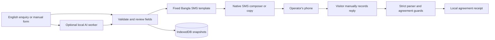

# LocalRelay

### Local experiences. Connected by SMS.

**The visitor’s smartphone does the AI work. The local operator keeps the phone they already own.**

LocalRelay helps an English-speaking visitor make a structured enquiry to a Bangla-speaking local business through SMS. It combines a small on-device AI experiment, mandatory human review, compact Bangla message templates, and an explicit offer → acceptance → acknowledgement workflow.

Built by **Team Protos** for the **7th Hack-Nation Global AI Hackathon**.

| Try it | Link |
|---|---|
| Hosted application | [localrelay-test.vercel.app](https://localrelay-test.vercel.app) |
| Interactive two-phone demo | [Open the demo](https://localrelay-test.vercel.app/demo) |
| Full source code | [GitHub repository](https://github.com/akiibot/LocalRelay) |
| Build and test automation | [GitHub Actions](https://github.com/akiibot/LocalRelay/actions) |

**Prototype status:** the working workflow is manual-first; AI routing is optional and experimental. The browser demo simulates SMS exchanges. A user-reported real smartphone SMS pilot is documented separately. Basic-phone compatibility and independent Bangla review remain unverified; model limitations and measured results are detailed below.

## The problem and the idea

A visitor may have internet, a smartphone, and an English-language request. A local operator may use a basic phone and Bangla, with no app to install. Requiring both sides to adopt another smartphone application leaves that operator outside the conversation.

LocalRelay puts the application and computation on the visitor’s device, then uses SMS for the operator-facing exchange. The prototype supports a bounded local experience enquiry: date, time, party size, meal counts where applicable, and a full quoted price in BDT. It is not a general-purpose translator or an automatic booking service.

The distinctive design is the combination of **asymmetric devices**, **reviewed structured messages**, and **explicit agreement states**. The operator needs neither an AI account nor a smartphone app. The visitor can prepare the app online and use its cached workflow offline; sending messages still requires cellular SMS service and may incur carrier charges.

## Try the demo in about a minute

1. Open [the interactive demo](https://localrelay-test.vercel.app/demo). It needs no account, phone number, or typing.
2. Choose the standard-offer scenario and **Use preset manual form** for the reliable complete path. You can also run the actual local AI to inspect its current result and fallback.
3. Review the request and Bangla preview, then advance the simulated enquiry to the operator’s phone.
4. Send the operator’s offer, review and accept its exact terms, then send the visitor’s acceptance.
5. Send and record the matching operator acknowledgement. The visitor reaches **Agreement recorded** only after that match.
6. Replay with a different-time offer or a decline to explore the other outcomes.

The demo uses the application’s renderer, reply parser, and protocol guards in an in-memory simulation. It sends **no real SMS**, writes no saved requests, and resets on reload. It works offline after the application files have been prepared.

For the regular app workflow, wait for **Ready for offline use** on Home, select an experience, and choose manual entry. Review and save the exact request locally, then open the native SMS composer or copy the text. Record replies manually after checking the sender in your SMS app. Demo profiles contain no real phone numbers; an owner-consented test number can be entered locally.

## What is implemented

- **Offline PWA:** service-worker caching, asset hash/size checks, readiness reporting, cache-loss handling, and explicit updates.
- **Visitor workflow:** required date/time/count choices, shared validation, English review and exact Bangla preview, local saved requests, and immutable revisions.
- **Small AI:** trained classical intent and requirement classifiers running in a Web Worker on the visitor’s device, with confidence-based abstention and manual fallback.
- **SMS tools:** native composer links, copy fallbacks, Unicode/GSM-7 segment estimates, and strict reply parsing.
- **Agreement protocol:** correlation IDs and revisions; frozen offers; exact acceptance/acknowledgement matching; duplicate, conflict, decline, expiry, and stale-reply handling.
- **Inspection and evaluation:** interactive demo, protocol simulator, model diagnostics, consent-based local study tools, independent Bangla-review exports, and clearly labeled synthetic review examples.

Opening the SMS composer does not mean a message was sent. **I sent this** is a user report, not a carrier delivery receipt. Agreement recorded means matching terms were manually entered and checked; it does not guarantee service availability or fulfilment.

## How it is built



| Layer | Implementation |
|---|---|
| Interface | React, TypeScript, React Router, Vite |
| Validation and storage | Zod contracts; IndexedDB through `idb` |
| Offline operation | Workbox service worker through `vite-plugin-pwa`; generated asset-readiness manifest |
| Local inference | Shared TypeScript hashed features; exported float32 logistic-regression weights; Web Worker |
| Development training | Python, NumPy, SciPy, scikit-learn; grouped train/development/test splits |
| Quality checks | Vitest, Testing Library, Playwright, Python/JavaScript parity, SMS and artifact checks |
| Hosting | Static Vercel deployment with route rewrites, CSP, and asset headers |

The AI routes **seven intent classes** and flags **six requirement categories**. It uses word unigrams/bigrams and character 3–5-grams hashed into 8,192 feature bins. Rules extract bounded fields, visitors review them, and fixed templates produce Bangla; the classifier does not generate translations. Model hashes, shape, class order, and numerical compatibility are checked before use.

The inference worker and caching service worker are separate. There is **no inference server, hosted translator, SMS gateway, account system, or booking database**. The initial download needs internet; browser storage eviction can require preparation again. See [architecture](docs/architecture.md) and the [exact SMS protocol](docs/sms-protocol.md).

## Run locally

**Requirements:** Node.js **22.12 or later** and npm. The recorded development checks used Node 22.19.0 and npm 10.9.3. Python is needed only to retrain or run the development corpus pipeline. Frontend builds use committed model artifacts; no API keys or environment variables are required.

```sh
git clone https://github.com/akiibot/LocalRelay.git
cd LocalRelay
npm ci
npm run dev
```

Open the URL Vite prints. For production/offline behaviour:

```sh
npm run build
node scripts/serve-production.mjs
# Open http://127.0.0.1:4173
```

`npm run preview` is also available. The included production test server additionally applies the checked-in Vercel CSP and stricter missing-asset behaviour. Service workers require HTTPS or localhost; a phone visiting a plain HTTP LAN address cannot prepare the offline PWA. Use the [hosted HTTPS app](https://localrelay-test.vercel.app) for phone testing.

For Vercel, use the repository root, Vite preset, Node 22.x, install command `npm ci`, build command `npm run build`, and output directory `dist`. [Deployment instructions and recorded verification](docs/deployment-vercel.md).

## Verify the implementation

Run from the repository root:

```sh
npm run typecheck
npm run lint
npm run test
npm run ml:parity
npm run check:challenges
npm run check:sms
npm run build
npm run check:budgets
npx playwright install chromium
npm run test:e2e
```

Rebuild after changing application code: browser tests use the production `dist` output. Linux CI installs Chromium system dependencies with `npx playwright install --with-deps chromium`. [The workflow](.github/workflows/ci.yml) also runs the separate development corpus checks with Python; see [training instructions](ml/README.md) and [independent-data workflow](docs/corpus-workflow.md).

Recorded verification includes 59 unit/component checks and a complete 23-check production browser run, including 20 scripted offline agreement workflows. These are **software tests with synthetic fixtures**, not 20 physical SMS exchanges. Detailed run history and current evidence are in [evidence status](docs/evidence-status.md), [UI verification](docs/ui-ux-qa.md), and [deployed-origin checks](docs/deployment-checks.json).

## Results, lessons, and limitations

| Measure | Recorded result | Interpretation |
|---|---|---|
| Model package | 427,800 bytes | Below the 1 MiB project budget; includes model metadata/features and weights |
| Application build | 1,055,654 uncompressed bytes | Recorded artifact snapshot; below the 5 MiB offline budget, not a complete network-traffic estimate |
| Python/JavaScript parity | 30 fixtures; max absolute difference approximately 2.33e-15 | Exported inference implementation agrees numerically; this does not measure language quality |
| Warm inference | 1.2 ms p95; 50 successful desktop Chromium runs | Fixed synthetic fixture on desktop; low-end Android timing remains pending |
| Intent macro-F1 | **0.321 learned model vs 0.729 keyword baseline** | Same grouped synthetic held-out split; learned model missed the 0.85 target |

**What worked:** the manual workflow, compact message renderer, guarded agreement states, local persistence, actual browser inference, and tested offline preparation/reopening. The builder reported a four-message Samsung Galaxy A55 ↔ Redmi Note 11 exchange over Grameenphone, agreement recording, and receipt persistence. This is a reported smartphone pilot, not independent proof of basic-phone compatibility. [Pilot observations](docs/field-observations.md).

**What did not work well:** the current AI was trained on 336 developer-authored synthetic examples and underperformed the keyword baseline. Normal supported enquiries can trigger abstention. Manual entry is therefore the recommended path; AI remains inspectable and experimental. The pilot helper understood the Bangla but found its presentation insufficiently organized. The live templates remain **unreviewed**, with no independent native-review results collected.

Next steps are independent enquiry data and unseen-author evaluation, native Bangla review, varied real basic-phone/carrier exchanges, and low-end Android and visitor/operator studies. There are no real participant-study results or measured visitor productivity gains to claim yet. [Model card](ml/model-card.md) · [Dataset card](ml/dataset-card.md) · [Remaining work](docs/remaining-work.md).

## Data and operational boundaries

Requests, phone overrides, receipts, and opt-in study data stay in browser storage; the app does not upload them to an application backend. Hosting still receives ordinary asset requests. IndexedDB is not application-encrypted, shared-device users can access it, and SMS is not end-to-end encrypted.

The application does not automatically send SMS or read the inbox. Users check senders and enter replies themselves; correlation IDs are not authentication. Unsupported requirements can require direct contact, and unknown wording can escape detection. No payments, live inventory, or fulfilment guarantees are implemented. Deleting a local request does not cancel a service. Retention cleanup occurs on local reads rather than a guaranteed background timer. [Full boundaries](docs/architecture.md).

## Team and documentation

**Team Protos — Yeanul Haque Khan Akib**, solo builder; Computer Science student at BRAC University and intern at a Canadian AI product company.

- [Architecture](docs/architecture.md) and [SMS protocol](docs/sms-protocol.md)
- [Draft Bangla operator guide](docs/operator-guide-bn.md)
- [Model training](ml/README.md), [model card](ml/model-card.md), and [dataset card](ml/dataset-card.md)
- [Evaluation protocol](docs/evaluation-protocol.md) and [external verification checklist](docs/external-verification.md)
- [Evidence status](docs/evidence-status.md) and [deployment guide](docs/deployment-vercel.md)

Source code is available on **`main`** under the [MIT License](LICENSE).
